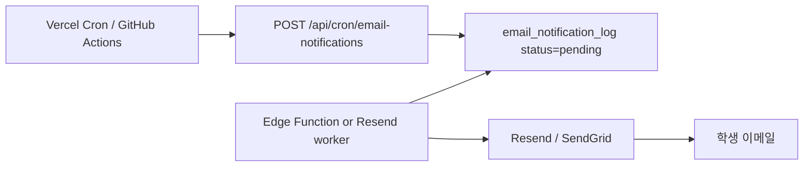

# 이메일 정기 알림 시스템

## 개요

관리자가 등록한 **전역 입시 일정**(`is_global = true`)을 기준으로 학생에게 자동 메일을 발송합니다.

| 유형 | 조건 | 발송 주기 |
|------|------|-----------|
| `weekly_digest` | 해당 주 전역 일정 요약 | 주 1회 (월요일 09:00 KST 권장) |
| `event_reminder` | `is_major = true` 일정 시작 24시간 전 | 매시간 스캔 (23~25h 윈도우) |

## DB 테이블

- `email_preferences` — 학생별 수신 설정
- `email_notification_log` — 발송 대기/완료 로그
- `events.is_major` — 리마인더 대상 주요 일정 플래그

## 아키텍처



1. **Cron**이 `/api/cron/email-notifications?job=weekly_digest` 호출
2. API가 대상 학생·일정을 계산해 `email_notification_log`에 `pending` row INSERT
3. **별도 워커**(Supabase Edge Function 권장)가 `pending` row를 읽어 Resend API로 실제 발송 후 `sent` 업데이트

## 환경 변수

```env
CRON_SECRET=random-long-secret
SUPABASE_SERVICE_ROLE_KEY=...
RESEND_API_KEY=...   # 워커에서 사용
```

## Cron 호출 예시

```bash
# 주간 요약 (매주 월 09:00)
curl -X POST "https://your-app.vercel.app/api/cron/email-notifications?job=weekly_digest" \
  -H "Authorization: Bearer $CRON_SECRET"

# D-1 리마인더 (매시간)
curl -X POST "https://your-app.vercel.app/api/cron/email-notifications?job=event_reminder" \
  -H "Authorization: Bearer $CRON_SECRET"
```

## Supabase OAuth (카카오·네이버)

Dashboard → **Authentication → Providers**:

1. **Google** — 기본 활성화
2. **Kakao** — Custom OAuth 또는 Kakao OIDC 플러그인, Redirect URL: `https://<project>.supabase.co/auth/v1/callback`
3. **Naver** — Custom OAuth, Client ID/Secret 등록

Redirect URL (로컬): `http://localhost:3000/auth/callback`

## 관리자: 주요 일정 표시

전역 일정 등록 시 **「주요 일정」** 체크 → `is_major=true` → 24시간 전 리마인더 큐에 포함됩니다.
